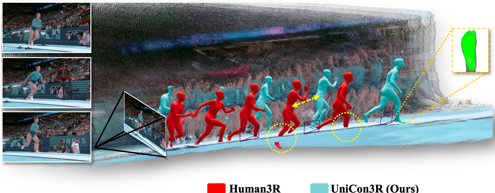

# UniCon3R: Contact-Driven Human-Scene Reconstruction from Monocular Video

<p align="center">
  <a href="https://surtantheta.github.io/">Tanuj Sur</a><sup>1</sup> &nbsp;
  <a href="https://sha2nkt.github.io/">Shashank Tripathi</a><sup>2</sup> &nbsp;
  <a href="https://atnikos.github.io/">Nikos Athanasiou</a><sup>2</sup> &nbsp;
  <a href="https://www.comp.nus.edu.sg/~hlinhn/">Ha Linh Nguyen</a><sup>1</sup> &nbsp;
  <a href="https://kai422.github.io/">Kai Xu</a><sup>1</sup> &nbsp;
  <a href="https://is.mpg.de/ps/person/black">Michael J. Black</a><sup>2</sup> &nbsp;
  <a href="https://www.comp.nus.edu.sg/~ayao/">Angela Yao</a><sup>1</sup>
</p>

<p align="center">
  <sup>1</sup>National University of Singapore &nbsp;&nbsp;
  <sup>2</sup>Max Planck Institute for Intelligent Systems, T&uuml;bingen, Germany
</p>

<p align="center">
  <a href="https://arxiv.org/abs/2604.19923"></a>
  <a href="https://surtantheta.github.io/UniCon3R/"></a>
  <a href="https://github.com/surtantheta/UniCon3R"></a>
</p>

<p align="center">
  
</p>

<p align="center">
  <em>Figure 1. Visually plausible reconstructions can still be physically ungrounded.</em>
</p>

## TL;DR

**UniCon3R** is a unified feed-forward framework for online human-scene 4D reconstruction from monocular video. The key idea is to make human-scene contact an internal corrective signal, rather than only an auxiliary output or post-hoc metric.

## Highlights

- **Unified online reconstruction:** jointly recovers scene geometry, camera motion, and 3D human bodies from monocular video.
- **Contact-aware reasoning:** predicts dense body-scene contact and feeds the refined contact representation back into the human reconstruction pathway.
- **Physically grounded motion:** improves body-scene alignment and reduces physically implausible artifacts such as floating bodies and scene penetration.
- **Feed-forward inference:** keeps the reconstruction pipeline online and avoids test-time optimization.

## Release Status

- Project page and interactive 4D visualizations are available now.
- Paper is available on [arXiv](https://arxiv.org/abs/2604.19923).
- **Code, checkpoints, installation instructions, and inference scripts will be released soon in this repository.**

## Method Overview

UniCon3R extends feed-forward human-scene reconstruction with two coupled components:

- **Scene-aware contact prompt:** combines scene context, explicit local geometry, and temporal contact history into an interaction-aware representation.
- **Contact-guided latent refinement:** uses the refined contact token to update the human latent before final body regression, allowing contact to actively correct the reconstruction.

## Interactive Results

The project page includes synchronized input videos and interactive 4D reconstructions:

<p align="center">
  <a href="https://surtantheta.github.io/UniCon3R/"><b>Open Interactive Results</b></a>
</p>

Viewer controls:

- Drag with left click to rotate.
- Scroll to zoom in/out.
- Drag with right click to move the view.
- Use `W/S`, `A/D`, and `Q/E` for keyboard navigation.

## Usage

The public code release is in preparation. This section will be updated with:

- Environment setup.
- Model and checkpoint downloads.
- Single-video inference.
- Interactive visualization export.
- Evaluation instructions.

## Citation

```bibtex
@article{sur2026unicon3r,
  title={UniCon3R: Contact-aware 3D Human-Scene Reconstruction from Monocular Video},
  author={Sur, Tanuj and Tripathi, Shashank and Athanasiou, Nikos and Nguyen, Ha Linh and Xu, Kai and Black, Michael J. and Yao, Angela},
  journal={arXiv preprint arXiv:2604.19923},
  year={2026}
}
```

## Acknowledgements

This project builds on ideas, tools, and benchmarks from the human-scene reconstruction and 3D vision community, including:

- [Human3R](https://github.com/fanegg/Human3R)
- [UniSH](https://github.com/murphylmf/UniSH)
- [CUT3R](https://github.com/CUT3R/CUT3R)
- [DUSt3R](https://github.com/naver/dust3r)
- [MASt3R](https://github.com/naver/mast3r)
- [MoGe](https://github.com/microsoft/MoGe)
- [JOSH](https://github.com/genforce/JOSH)
- [DECO](https://github.com/sha2nkt/deco)
- [Viser](https://github.com/nerfstudio-project/viser)
- [RICH](https://rich.is.tue.mpg.de/), [EMDB](https://eth-ait.github.io/emdb/), [SLOPER4D](https://github.com/climbingdaily/SLOPER4D), and [3DPW](https://virtualhumans.mpi-inf.mpg.de/3DPW/)

## License

License information will be updated with the code release.
